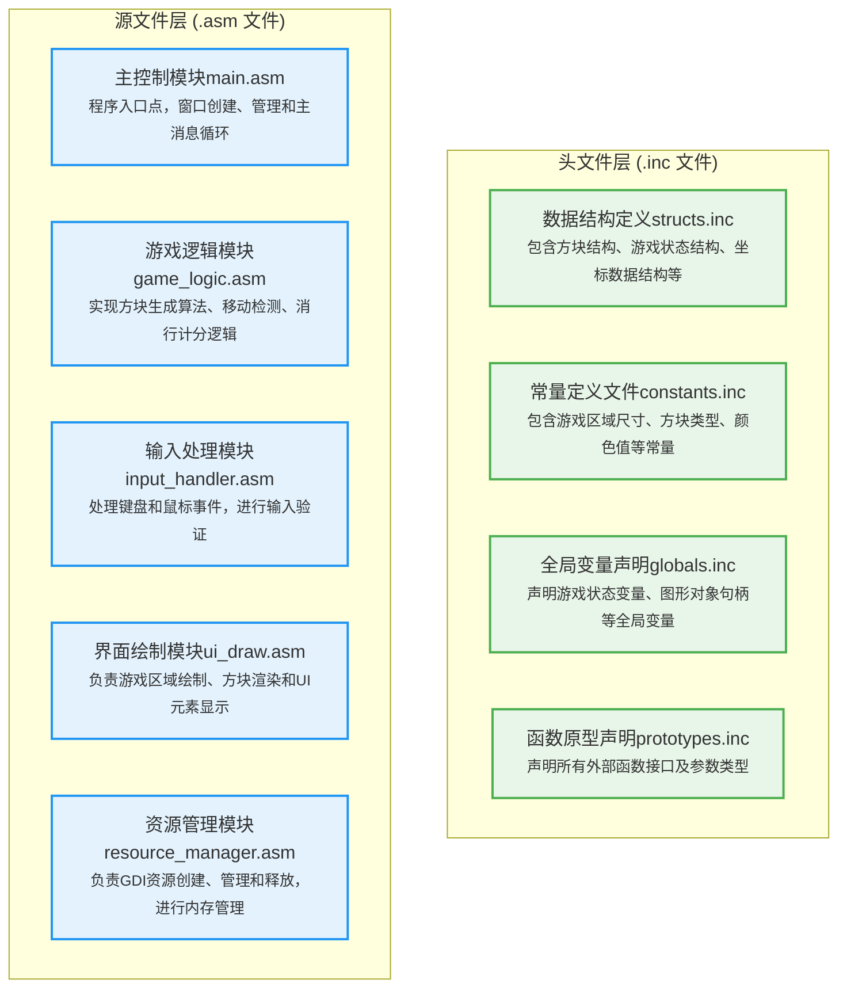

## 实验目标

使用32位汇编语言编写一个进阶版2048小游戏。

## 实验环境

本实验环境采用 `MASM（ML.exe）`+ `MASM32 SDK` 的 `Win32 API` 宏与库文件，可以在`（x86-64）` windows系统上运行。


## 游戏规则

### 界面与操作

**游戏界面**：界面右侧为功能栏，从上到下依次为游戏名称“合成北理工”、游戏当前得分表和历史得分表、“重新开始”按钮、游戏操作指南；界面左侧为4×4的方格矩阵，初始随机生成两个内容块（“民大”或“北林”）

**移动操作**：玩家通过方向键W/A/S/D键控制所有内容块向指定方向移动

**合并规则**：相同的内容块在移动中相遇时会合并，生成下一阶内容块

**生成新方块**：每次有效移动后，在随机空白位置生成一个“民大”内容块（90%概率）或“北林”内容块（10%概率）

**得分计算**：每次合并生成新内容块对应的数值累加到游戏总分，历史最高分会被记录

### 胜利条件

任一内容块成功合成“北理”时，游戏成功，可以选择继续游戏，进入无尽模式

若所有格子均被填满且经系统判定无任何移动可能，则游戏失败

## 游戏框架

### 项目架构

本项目采用基于文件划分的模块化架构，通过统一的包含文件（.inc）共享数据和接口定义：



### 数据流和控制流

**启动流程**：main.asm → WinMain → 注册窗口类 → 创建窗口 → 消息循环

**用户输入流程**：WM_KEYDOWN消息 → input_handler.asm → game_logic.asm

**画面更新流程**：WM_PAINT消息 → ui_draw.asm → 双缓冲绘图

**游戏逻辑流程**：移动操作 → 矩阵更新 → 胜负判断 → 分数计算

## 模块功能及实现

### 主控制模块(main.asm)

**模块功能**：

* 全局数据的定义与初始化

```
; 窗口句柄结构体
WINDOW_HANDLES STRUCT
    hInstance dd ?    ; 应用程序实例句柄
    hWinMain dd ?     ; 主窗口句柄
WINDOW_HANDLES ENDS

; 游戏数据全局实例定义
.data
    windowHandles WINDOW_HANDLES <>    ; 窗口句柄实例
    gameData GAME_DATA <>              ; 游戏数据实例
    inputState INPUT_STATE <>          ; 输入状态实例
    drawRes DRAW_RESOURCES <>          ; 绘制资源实例
```

* 定义程序入口点，控制执行流程

```
main proc
    ; 调用窗口主函数
    invoke WinMain
    ; 程序退出
    invoke ExitProcess, NULL
    ret
main endp
```

* 注册并创建主窗口

```
WinMain proc
    ; …………
    ; 获取当前模块句柄，初始化窗口类结构
    
    ; 注册窗口类
    invoke RegisterClassEx, addr wcex
    .if eax == 0
        invoke ExitProcess, NULL  ; 注册失败则退出
    .endif
    
    ; 创建主窗口
    invoke CreateWindowEx, WS_EX_CLIENTEDGE,
            offset szClassName, offset szTitleMain,
            WS_OVERLAPPED or WS_CAPTION or WS_SYSMENU,
            400, 50, WINDOW_WIDTH, WINDOW_HEIGHT,
            NULL, NULL, windowHandles.hInstance, NULL
    mov windowHandles.hWinMain, eax
    
    ; 显示并更新窗口
    invoke ShowWindow, windowHandles.hWinMain, SW_SHOWNORMAL
    invoke UpdateWindow, windowHandles.hWinMain
    
    ret
WinMain endp
```

* 管理Windows消息循环管理

采用Windows消息循环模式，通过GetMessage获取消息，TranslateMessage转换键盘消息，DispatchMessage分发给窗口过程函数处理

* 窗口过程函数

WinMainProc函数处理所有Windows消息，包括WM_CREATE（初始化）、WM_KEYDOWN（键盘输入）、WM_PAINT（界面重绘）等，并通过switch-case结构分发消息到相应处理模块

### 游戏逻辑模块(game_logic.asm)

**模块功能**：

* 游戏状态初始化和重置

```
; 数据结构定义
GAME_DATA STRUCT
    score dd 0                ; 当前游戏分数
    bestScore dd 0           ; 历史最高分数
    reached2048 dd 0         ; 是否达到2048标志
    infiniteMode dd 0        ; 无尽模式标志
    gameEnd dd 0             ; 游戏结束标志
    movedUp dd 0             ; 上移有效标志
    movedDown dd 0           ; 下移有效标志
    movedLeft dd 0           ; 左移有效标志
    movedRight dd 0          ; 右移有效标志
    randomSeed dd 0          ; 随机数生成种子
    numMat dd 16 dup(?)      ; 4×4游戏矩阵（16个双字）
    numMatCopy dd 16 dup(?)  ; 矩阵副本（用于移动检测）
    flag dd 4 dup(?)         ; 合并标记数组
GAME_DATA ENDS
```

* 四个方向的移动和合并算法实现

以“数字上移”操作为例，算法采用逐列处理的方式。对每一列，从第二行开始向上检查每个非零数字；对每个数字，向上搜索直到遇到非空位置。如果遇到空位，则将数字上移；如果遇到相同数字且该位置未合并过，则合并并加倍分数。

```
moveUp proc
    ; 变量初始化
    .while col < 4          ; 遍历每一列
        ; 重置合并标记（每列独立）
        .while row < 4      ; 从第二行开始向上处理
            ; 计算当前位置索引：index = row*4 + col
            ; 向上搜索可移动或可合并的位置
            .while r >= 0 && currentNum != 0
                ; 计算上方位置索引
            
                .if tmpNum == 0
                    ; 情况1：上方为空，可以移动
                    ; 移动到上方
                    ; 清空原位置
                    
                    mov ecx, r
                    mov targetRow, ecx      ; 更新目标行
                    mov changed, 1          ; 标记有变化
                    
                .elseif tmpNum == ecx && gameData.flag[edi*4] == 0
                    ; 情况2：上方数字相同且未合并过，可以合并
                    ; 数字加倍
                    mov gameData.numMat[eax*4], ecx
                    
                    ; 增加分数
                    add gameData.score, ecx
                    
                    ; 清空原位置
                    
                    ; 标记该位置已合并（防止一回合内多次合并）
                    mov edi, r
                    mov gameData.flag[edi*4], 1
                    mov changed, 1
                    .break                  ; 合并后终止搜索
                .else
                    ; 情况3：上方数字不同或已合并，无法移动
                    .break
                .endif
                
                .if r == 0
                    .break                  ; 已到达最上方
                .endif
                dec r                       ; 继续向上搜索
            .endw
            inc row
        .endw
        inc col
    .endw
    
    .if changed == 1
        mov gameData.movedUp, 1             ; 标记上移有效
    .endif
    popad
    ret
moveUp endp
```

每次合并操作后对方块进行标记，防止同一回合内多次合并。

* 移动可能性检测和游戏结束判断

通过尝试所有四个方向的移动来判断游戏是否结束。每次尝试前备份矩阵状态，尝试后恢复，避免影响实际游戏状态。如果有任一方向可以移动，游戏继续；否则游戏结束。

```
canMove proc
    ; 保存当前分数
    ; 备份当前游戏矩阵状态
    
    ; 尝试上移并检查是否有变化
    invoke moveUp
    ; 恢复矩阵状态
    mov ecx, 0
    .while ecx < 16
        mov esi, gameData.numMatCopy[ecx*4]
        mov gameData.numMat[ecx*4], esi
        inc ecx
    .endw
    
    ; 尝试下移并恢复矩阵状态
    ; 尝试左移并恢复矩阵状态
    ; 尝试右移并恢复矩阵状态

    ; 判断是否还有移动可能
    .if gameData.movedUp == 1 || gameData.movedDown == 1 || 
        gameData.movedLeft == 1 || gameData.movedRight == 1
        mov gameData.gameEnd, 0      ; 仍有移动可能，游戏继续
    .else
        mov gameData.gameEnd, 1      ; 无移动可能，游戏结束
    .endif
    
    ; 恢复原始分数
    mov eax, oldScore
    mov gameData.score, eax
    
    popad
    ret
canMove endp
```

* 随机数生成和分数计算

采用线性同余法（LCG）生成伪随机数。算法公式为X_{n+1} = (a * X_n + c) mod m，其中a=0343fdh，c=269ec3h，m=16。生成的随机位置确保在空白格子中，生成的数字按9:1比例产生2或4

### 输入处理模块(input_handler.asm)

**模块功能**：

处理用户输入，包括键盘按下事件处理（方向键和WASD）、键盘释放事件处理、鼠标点击事件处理（重新开始按钮）以及输入状态管理。

* 键盘输入处理

handleKeyDown函数处理键盘按下事件，通过wParam参数识别按键。为防止重复触发，使用输入状态结构体记录按键状态，只在按键首次按下时处理。

```
handleKeyDown proc uses ebx, wParam:DWORD, hWnd:DWORD
    mov ebx, wParam          ; 获取按键虚拟码
    
    .if ebx == VK_UP || ebx == "W" || ebx == "w"
        ; 处理上移请求
        .if inputState.isUpPressed == 0    ; 防重复触发
            mov inputState.isUpPressed, 1  ; 标记按键按下
            invoke moveUp                  ; 执行上移操作
            
            ; 如果移动有效，生成新方块
            .if gameData.movedUp == 1
                invoke randomLCG
            .endif
            
            ; 检查游戏是否结束            
            ; 请求重绘窗口
            invoke InvalidateRect, hWnd, NULL, FALSE
        .endif
    
    .elseif ebx == VK_DOWN || ebx == "S" || ebx == "s"
        ; 处理下移请求
    
    ; 左移和右移处理类似...
    .endif
    ret
handleKeyDown endp
```

* 鼠标点击处理

handleMouseClick函数处理鼠标点击事件，用于ReStart检测。通过lParam参数解析鼠标坐标，检测是否点击了重新开始按钮区域（640,275)-(960,325）。如果点击了该区域，弹出确认对话框，用户确认后重新初始化游戏。

```
handleMouseClick proc uses ecx edx, lParam:DWORD, hWnd:DWORD
    ; 解析鼠标坐标（lParam低16位为X，高16位为Y）
    ; 检测是否点击了重新开始按钮区域（640,275)-(960,325)
    .if ecx >= 640 && ecx <= 960
        .if edx >= 275 && edx <= 325
            ; 弹出确认对话框
            invoke MessageBox, hWnd, addr MSG_RESTART_CONFIRM,
                    addr MSG_RESTART_TITLE, MB_YESNO
            .if eax == IDYES
                invoke initGameData          ; 重新初始化游戏数据
                invoke InvalidateRect, hWnd, NULL, FALSE  ; 重绘窗口
            .endif
        .endif
    .endif
    ret
handleMouseClick endp
```

### 界面绘制模块(ui_draw.asm)

**模块功能**：

* 数字方块绘制

根据数字值选择不同颜色的画刷和字体。采用渐变色方案，数字越大颜色越深。根据数字到字符串的地址映射将计算得到的数值转化为文字显示，如2显示为"民大"，2048显示为"北理"。根据数字位数调整字体大小和位置，确保视觉效果。

* 界面布局管理

用常量定义所有界面元素的尺寸和位置。主要区域包括左侧游戏矩阵区域、右侧标题、分数面板、重新开始按钮和操作指南。

### 资源管理模块(resource_manager.asm)

**模块功能**：

管理GDI资源，实现字体、画刷的创建和初始化，游戏结束时正确释放资源，防止资源泄漏的内存管理。

* 画刷和字体初始化

initFonts函数创建所有需要的字体和画刷。字体包括不同大小的微软雅黑，用于标题、分数、数字等。画刷包括多种颜色，对应不同的方块和按键背景色。

```
initFonts proc
    push eax
    
    ; 创建方块数字字体（90号，加粗）
    invoke CreateFont, 90, 0, 0, 0, FW_BLACK, FALSE, FALSE, FALSE,
            DEFAULT_CHARSET, OUT_CHARACTER_PRECIS, CLIP_CHARACTER_PRECIS,
            DEFAULT_QUALITY, DEFAULT_PITCH or FF_DONTCARE, addr szFontName
    mov drawRes.FONT_CELL_NUM, eax
    
    ; ... 创建其他字体（标题字体、分数字体、按钮字体等）
    
    ; 创建数字方块颜色画刷
    invoke CreateSolidBrush, COLOR_NUM0_BG
    mov drawRes.BRUSH_CELL_0, eax
    
    invoke CreateSolidBrush, COLOR_NUM2_BG
    mov drawRes.BRUSH_CELL_2, eax

    ; ... 创建其他颜色画刷
    
    pop eax
    ret
initFonts endp
```

* 资源清理

cleanupResources函数在程序退出前删除所有GDI对象。通过检查句柄有效性避免重复删除，确保资源正确释放，防止内存泄漏。

### 数据定义和常量文件(.inc)

* struct.inc

定义项目中使用的所有数据结构，包括游戏数据、输入状态、绘制资源和窗口句柄，确保数据的组织性和访问的一致性。

* constants.inc

使用EQU指令定义颜色、尺寸、位置等所有常量。

* globals.inc和prototypes.inc

提供模块间的接口定义。globals.inc声明外部全局变量，prototypes.inc声明函数原型，确保类型安全和正确链接。

## 实验结果

### 游戏开始


### 无法移动，游戏结束


### 重新开始


### 游戏胜利


### 无尽模式

由于作者实在难以通关，所以暂时修改了一下代码逻辑（随机生成块修改为“清华”和“北理”），便于展示功能：


## 实验心得
