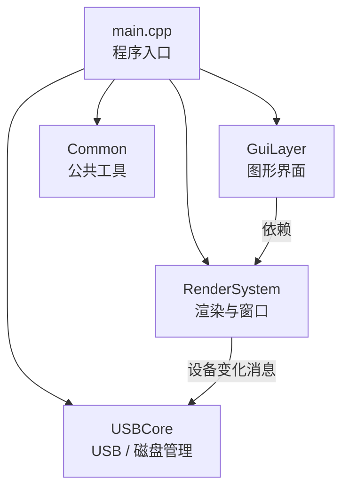

### 1 实验目标

USB 总线及挂载设备测试实验。通过读取、检测、使用计算机系统中的USB 总线及其挂载设备，体验 USB 总线的属性和特点，包括挂载的设备功能、传输 速率、接口编号等。可以使用任意编程语言，要求采用 GUI 界面，在 windows 或linux 操作系统平台上编写均可，可利用系统提供的功能实现。

==要求具备如下基本功能==：
- 软件能显示系统当前登录用户；
- 能检测系统中存在 的所有USB设备及对应的信息，如制造商、序列号、挂载的USB总线编号、传 输速度等；
- 能检测到系统中插入或者拔出U盘；
- 能向U盘文件中写入简单数据， 如文本字符；
- 能向U盘中传输（拷贝）文件；能删除U盘中的文件等基本功能。

==其他扩展功能（可选）==：
- 能显示当前挂载的 U 盘中的文件列表，列表中可 以包含隐藏文件；
- 能显示U盘中拷入或拷出文件时的即时速率；
- 其他功能不限。

### 2 实验环境

#### 2.1  硬件与系统环境

- **操作系统**：Windows 10 / Windows 11
- **硬件平台**：x64 架构 PC（支持 DirectX 11）

#### 2.2 软件与开发环境

- **集成开发环境**：Microsoft Visual Studio
- **编程语言**：C++
- **编译器**：MSVC（Visual C++）
- **图形接口**：DirectX 11
- **GUI 库**：Dear ImGui
- **系统接口**：Windows API（Win32、设备管理相关接口）

### 3 程序功能

#### 3.1 USB（U盘）监测
- **用户监测**：每次启动表盘的时候就会启动该功能，用于监测当前操作系统的登录用户。
- **USB监测**：是该实验最基本的功能。也是在表盘启动时候启动该功能。使用 `SetupDiEnumDeviceInfo` 接口枚举USB设备，再使用 `SetupDiGetDeviceRegistryProperty` 解析厂商、硬件ID、设备名称等信息，还进行了设备的协议查询。在表盘运行时也可以进行usb的插拔，刷新列表之后就可以查看变化。
- **U盘监测**：同样也是在表盘启动的时候监测U盘的挂载状态，同时可以监测U盘的热插拔。

#### 3.2 U盘传输
- **传输测速**：可以实现目标U盘的实时传输速率测量。
- **写入/复制文件**：
- **删除文件**：

#### 3.3 前端交互
- **用户显示**：表盘最上面会显示“当前用户”。
- **U盘挂载显示**：有一个下拉框可以显示目前的U盘挂载情况。
- **U盘测速**：在下拉框选中目标U盘之后可以点击“开始测速按钮”，就可以看见测速折线图，实时显示当前的数据传输速度。
- **USB监测**：表盘上会有一个表格，显示所有的USB的厂商、设备名、ID和协议信息。
- **写/删文件**:

### 4 设计方案

>程序采用模块化设计思想，将系统功能划分为程序入口、渲染系统、界面层和 USB 核心功能模块。以 `main.cpp` 作为程序入口，负责系统初始化和主循环控制；通过 Win32 消息机制驱动设备状态变化；  使用 DirectX 11 提供底层渲染支持；基于 Dear ImGui 实现轻量级图形用户界面；USB 相关功能独立封装，提高程序的可维护性和扩展性。

#### 4.1 系统架构设计

系统整体采用分层结构设计，主要包括以下模块：
- **程序入口模块（main）**  
    负责窗口创建、系统初始化、模块调用及程序生命周期管理。
- **渲染与窗口管理模块（RenderSystem）**  
    负责 Win32 窗口创建、DirectX 11 设备初始化、渲染流程控制及系统消息处理。
- **图形界面模块（GuiLayer）**  
    基于 ImGui 实现用户界面，负责界面布局、数据展示及用户交互逻辑。
- **USB 核心功能模块（USBCore）**  
    实现 USB 设备扫描、逻辑磁盘获取、文件读写、测速及设备变化事件处理。
- **公共工具模块（Common）**  
    提供数据结构定义、日志记录、字符串转换等基础工具函数。

#### 4.2 程序运行流程设计

- 程序启动后，首先创建 Win32 窗口并初始化 DirectX 11 与 ImGui 环境；  
- 随后进行用户、USB 设备、逻辑磁盘的初始扫描，更新到表盘上；  
- 进入主循环后，程序持续处理系统消息并刷新界面；  
- 当检测到 USB 设备插入或移除事件时，自动更新相关信息并显示在界面中；  
- 当监测到按键操作时，根据实践类型调用相应的函数，比如刷新，测速，文件写入和复制等等，并且更新到表盘。
- 程序退出时，释放系统资源并安全关闭。

### 5 程序框架

### 6 运行效果

### 实验心得