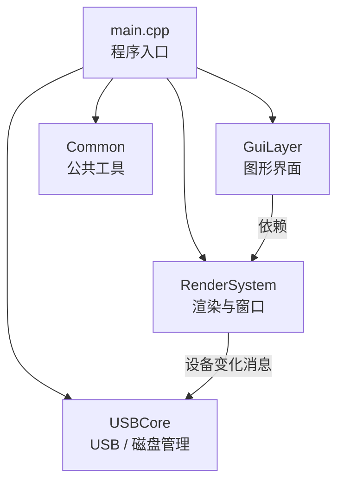
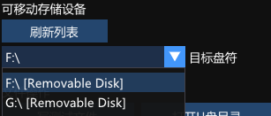
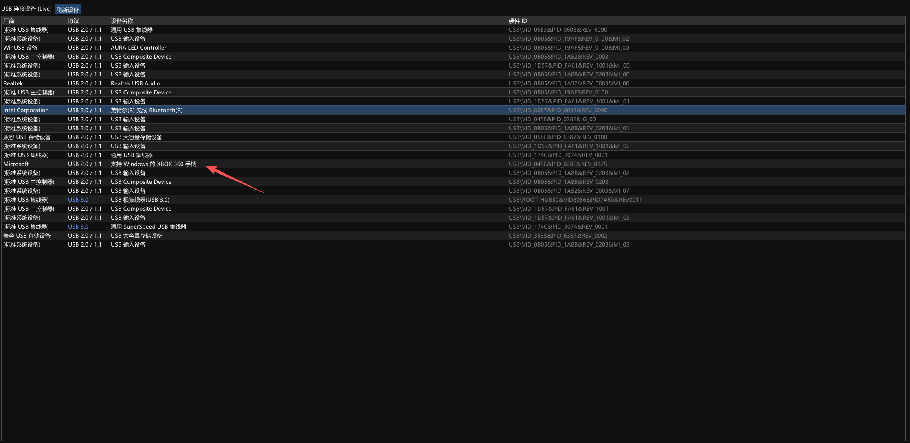
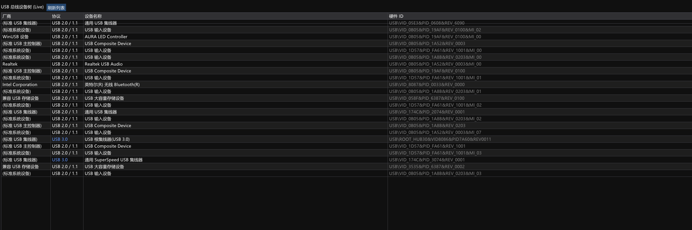
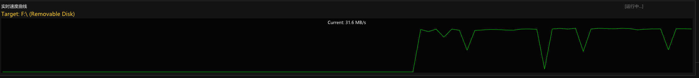
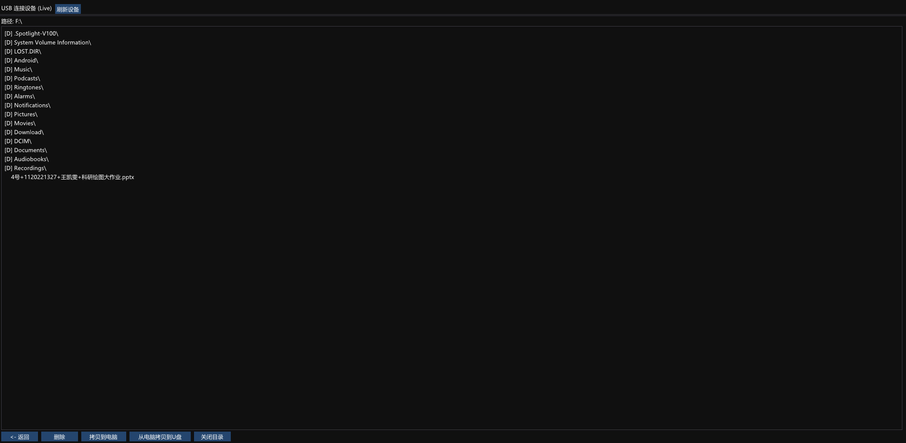
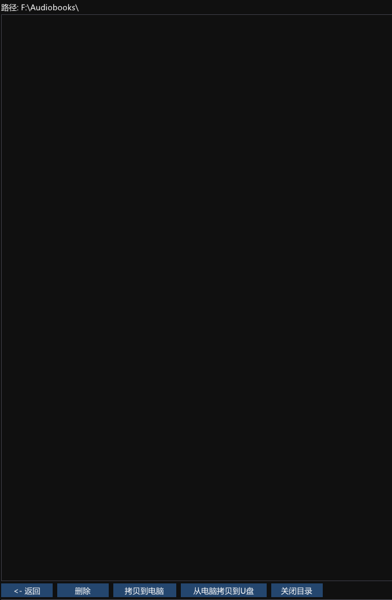
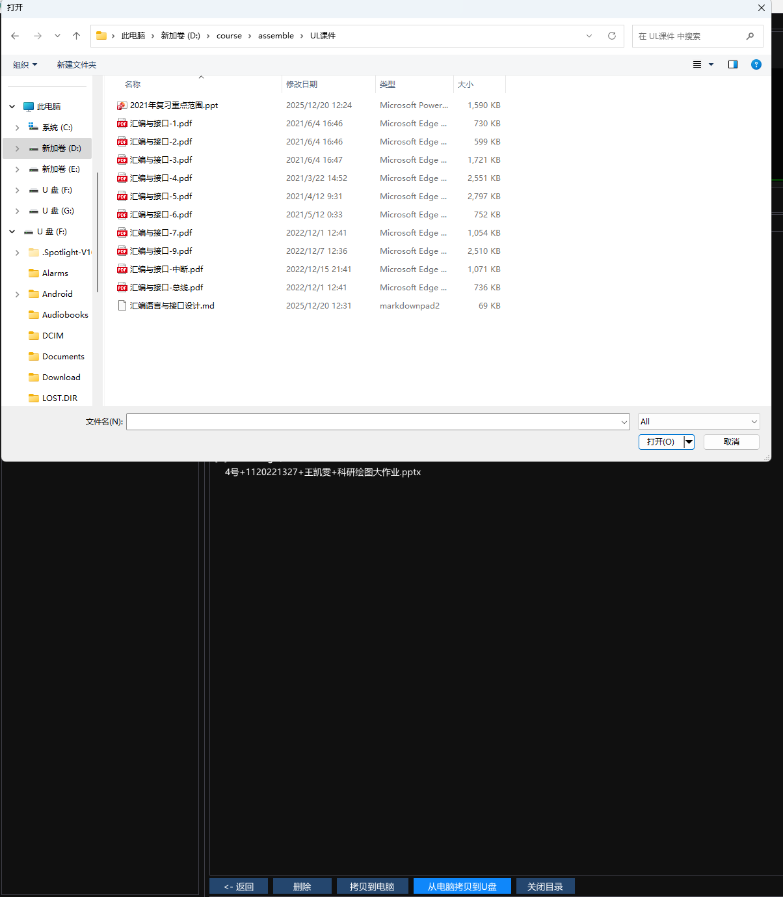
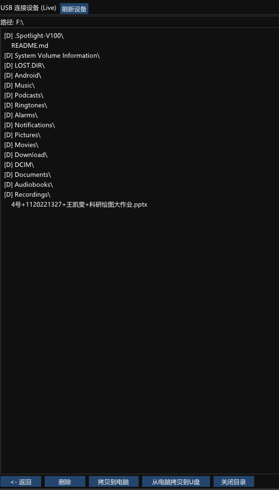

### 1 实验目标

USB 总线及挂载设备测试实验。通过读取、检测、使用计算机系统中的USB 总线及其挂载设备，体验 USB 总线的属性和特点，包括挂载的设备功能、传输 速率、接口编号等。可以使用任意编程语言，要求采用 GUI 界面，在 windows 或linux 操作系统平台上编写均可，可利用系统提供的功能实现。

==要求具备如下基本功能==：
- 软件能显示系统当前登录用户；
- 能检测系统中存在 的所有USB设备及对应的信息，如制造商、序列号、挂载的USB总线编号、传 输速度等；
- 能检测到系统中插入或者拔出U盘；
- 能向U盘文件中写入简单数据， 如文本字符；
- 能向U盘中传输（拷贝）文件；能删除U盘中的文件等基本功能。

==其他扩展功能（可选）==：
- 能显示当前挂载的 U 盘中的文件列表，列表中可 以包含隐藏文件；
- 能显示U盘中拷入或拷出文件时的即时速率；
- 其他功能不限。

### 2 实验环境

#### 2.1  硬件与系统环境

- **操作系统**：Windows 10 / Windows 11
- **硬件平台**：x64 架构 PC（支持 DirectX 11）

#### 2.2 软件与开发环境

- **集成开发环境**：**Microsoft Visual Studio** or **vscode**
```bash
# vscode编译命令，注意修改路径
g++ -fdiagnostics-color=always -g -finput-charset=UTF-8 -fexec-charset=UTF-8 D:\Code\C\Lab2\USB_Lab\main.cpp D:\Code\C\Lab2\USB_Lab\GuiLayer.cpp D:\Code\C\Lab2\USB_Lab\RenderSystem.cpp D:\Code\C\Lab2\USB_Lab\USBCore.cpp D:\Code\C\Lab2\USB_Lab\imgui\imgui.cpp D:\Code\C\Lab2\USB_Lab\imgui\imgui_draw.cpp D:\Code\C\La D:\Code\C\Lab2\USB_Lab\imgui\imgui_widgets.cpp D:\Code\C\Lab2\USB_Lab\imgui\imgui_impl_dx11.cpp D:\Code\C\Lab2\USB_Lab\imgui\imgui_impl_win32.cpp -ID:\Code\C\Lab2\USB_Lab -ID:\Code\C\Lab2\USB_Lab\imgui -o D:\Code\C\Lab2\USB_Lab\main.exe -ld3d11 -ld3dcompiler -ldxgi -lsetupapi -lgdi32 -luser32 -lole32 -luuid -ldwmapi -lcomdlg32
```

- **编程语言**：C++
- **编译器**：MSVC（Visual C++）
- **图形接口**：DirectX 11
- **GUI 库**：Dear ImGui
- **系统接口**：Windows API（Win32、设备管理相关接口）

### 3 设计方案

>程序采用模块化设计思想，将系统功能划分为程序入口、渲染系统、界面层和 USB 核心功能模块。以 `main.cpp` 作为程序入口，负责系统初始化和主循环控制；通过 Win32 消息机制驱动设备状态变化；  使用 DirectX 11 提供底层渲染支持；基于 Dear ImGui 实现轻量级图形用户界面；USB 相关功能独立封装，提高程序的可维护性和扩展性。

#### 3.1 系统架构设计

系统整体采用分层结构设计，主要包括以下模块：
- **程序入口模块（main）**  
    负责窗口创建、系统初始化、模块调用及程序生命周期管理。
- **渲染与窗口管理模块（RenderSystem）**  
    负责 Win32 窗口创建、DirectX 11 设备初始化、渲染流程控制及系统消息处理。
- **图形界面模块（GuiLayer）**  
    基于 ImGui 实现用户界面，负责界面布局、数据展示及用户交互逻辑。
- **USB 核心功能模块（USBCore）**  
    实现 USB 设备扫描、逻辑磁盘获取、文件读写、测速及设备变化事件处理。
- **公共工具模块（Common）**  
    提供数据结构定义、日志记录、字符串转换等基础工具函数。

#### 3.2 程序运行流程设计

- 程序启动后，首先创建 Win32 窗口并初始化 DirectX 11 与 ImGui 环境；  
- 随后进行用户、USB 设备、逻辑磁盘的初始扫描，更新到表盘上；  
- 进入主循环后，程序持续处理系统消息并刷新界面；  
- 当检测到 USB 设备插入或移除事件时，自动更新相关信息并显示在界面中；  
- 当监测到按键操作时，根据实践类型调用相应的函数，比如刷新，测速，文件写入和复制等等，并且更新到表盘。
- 程序退出时，释放系统资源并安全关闭。

### 4 程序功能

#### 4.1 USB（U盘）监测
- **用户监测**：每次启动表盘的时候就会启动该功能，用于监测当前操作系统的登录用户。
```c++
void GetUserInfo() {
    wchar_t username[256];
    DWORD len = 256;
    if (GetUserNameW(username, &len)) {
        std::string u = WStringToString(username);
        sprintf_s(g_userBuffer, "当前用户: %s", u.c_str());
    }
}
```
- **USB监测**：是该实验最基本的功能。也是在表盘启动时候启动该功能。使用 `SetupDiEnumDeviceInfo` 接口枚举USB设备，再使用 `SetupDiGetDeviceRegistryProperty` 解析厂商、硬件ID、设备名称等信息，还进行了设备的协议查询。在表盘运行时也可以进行usb的插拔，刷新列表之后就可以查看变化。
```c++
void ScanUSBDevices() {
    g_usbDevices.clear();
    g_selectedDeviceIndex = -1;
    HDEVINFO hDevInfo = SetupDiGetClassDevsW(NULL, L"USB", NULL, DIGCF_PRESENT | DIGCF_ALLCLASSES);
    if (hDevInfo == INVALID_HANDLE_VALUE) return;

    SP_DEVINFO_DATA DeviceInfoData;
    DeviceInfoData.cbSize = sizeof(SP_DEVINFO_DATA);

    for (DWORD i = 0; SetupDiEnumDeviceInfo(hDevInfo, i, &DeviceInfoData); i++) {
        DWORD DataT;
        wchar_t buffer[1024];
        DWORD buffersize = 0;

        if (!SetupDiGetDeviceRegistryPropertyW(hDevInfo, &DeviceInfoData, SPDRP_FRIENDLYNAME, &DataT, (PBYTE)buffer, sizeof(buffer), &buffersize))
            SetupDiGetDeviceRegistryPropertyW(hDevInfo, &DeviceInfoData, SPDRP_DEVICEDESC, &DataT, (PBYTE)buffer, sizeof(buffer), &buffersize);
        std::wstring name = buffer;

        SetupDiGetDeviceRegistryPropertyW(hDevInfo, &DeviceInfoData, SPDRP_HARDWAREID, &DataT, (PBYTE)buffer, sizeof(buffer), &buffersize);
        std::wstring hwid = buffer;

        SetupDiGetDeviceRegistryPropertyW(hDevInfo, &DeviceInfoData, SPDRP_MFG, &DataT, (PBYTE)buffer, sizeof(buffer), &buffersize);
        std::wstring mfg = buffer;

        USBDevice dev;
        dev.name = WStringToString(name);
        dev.hwid = WStringToString(hwid);
        dev.vendor = WStringToString(mfg);

        bool is30 = false;
        if (dev.hwid.find("ROOT_HUB30") != std::string::npos) is30 = true;
        if (dev.hwid.find("USB 3.0") != std::string::npos) is30 = true;
        if (dev.name.find("USB 3.0") != std::string::npos) is30 = true;
        if (dev.name.find("SuperSpeed") != std::string::npos) is30 = true;

        if (is30) dev.protocol = "USB 3.0";
        else dev.protocol = "USB 2.0 / 1.1";

        g_usbDevices.push_back(dev);
    }
    SetupDiDestroyDeviceInfoList(hDevInfo);
    AppLog("USB 设备列表已刷新！");
}
```
- **U盘监测**：同样也是在表盘启动的时候监测U盘的挂载状态，同时可以监测U盘的热插拔。
```c++
void RefreshDrives() {
    g_logicalDrives.clear();
    g_selectedDriveIdx = -1;
    DWORD drives = GetLogicalDrives();
    wchar_t driveName[] = L"A:\\";

    for (int i = 0; i < 26; i++) {
        if (drives & (1 << i)) {
            driveName[0] = L'A' + i;
            if (GetDriveTypeW(driveName) == DRIVE_REMOVABLE) {
                g_logicalDrives.push_back(WStringToString(driveName));
            }
        }
    }
    if (!g_logicalDrives.empty()) g_selectedDriveIdx = 0;

    if (g_logicalDrives.empty()) AppLog("未检测到可移动设备。");
    else AppLog("检测到 U 盘。");

    // 如果 UI 正在显示当前 U 盘目录，尝试刷新该目录的列表（保持在当前目录）
    if (g_showDriveFiles) {
        if (!g_currentPath.empty()) {
            ListFilesInDrive(g_currentPath);
        }
        else if (g_selectedDriveIdx >= 0 && g_selectedDriveIdx < g_logicalDrives.size()) {
            ListFilesInDrive(g_logicalDrives[g_selectedDriveIdx]);
        }
    }
}
```

#### 4.2 U盘传输
- **传输测速**：可以实现目标U盘的实时传输速率测量。每秒向U盘发送一个`512KB`的临时数据文件，通过传输开始和结束的时间计算“瞬时”的传输速度，每秒钟发一次。
```c++
void UpdateRealTimeMonitor() {
    if (!g_isMonitorRunning) return;
    if (g_selectedDriveIdx < 0 || g_logicalDrives.empty()) {
        g_isMonitorRunning = false; // 停止
        AppLog("监测已停止：设备不可用");
        return;
    }


    DWORD currentTick = GetTickCount();
    if (currentTick - g_lastMonitorTick < 1000) {
        return; 
    }
    g_lastMonitorTick = currentTick; 

    std::string drive = g_logicalDrives[g_selectedDriveIdx];
    std::string testFile = drive + "monitor.tmp";
    const size_t CHUNK_SIZE = 512 * 1024; // 512KB
    char* buffer = new char[CHUNK_SIZE];

    g_monitorDevName = drive + " (实时)";

    LARGE_INTEGER freq, start, end;
    QueryPerformanceFrequency(&freq);
    QueryPerformanceCounter(&start);

    std::ofstream out(testFile, std::ios::binary);
    out.write(buffer, CHUNK_SIZE);
    out.close();

    QueryPerformanceCounter(&end);

    double timeSec = (double)(end.QuadPart - start.QuadPart) / freq.QuadPart;
    float speedMB = (float)((CHUNK_SIZE / 1024.0 / 1024.0) / timeSec);

    g_speedHistory[g_historyOffset] = speedMB;
    g_historyOffset = (g_historyOffset + 1) % 90; 

    DeleteFileA(testFile.c_str());
    delete[] buffer;
}
```
- **写入/复制文件**：打开目录之后，可以写入一个测试文件，也可以从本地文件系统中选择一个文件填入。
```C++
//========================================
// ADD YOUR CODE HERE
//
//
//
//
//========================================
```
- **删除文件**：点击想要删除的文件即可对该文件进行删除
```c++
bool DeleteFileOnDrive(const std::string& fullPath) {
    // fullPath 是完整路径，如 "F:\\test.txt" 或目录
    // 尝试删除文件
    if (DeleteFileA(fullPath.c_str())) return true;
    // 如果是目录，尝试 RemoveDirectoryA
    if (RemoveDirectoryA(fullPath.c_str())) return true;
    return false;
}

```

#### 4.3 前端交互
- **用户显示**：表盘最上面会显示“当前用户”。
- **U盘挂载显示**：有一个下拉框可以显示目前的U盘挂载情况。
- **U盘测速**：在下拉框选中目标U盘之后可以点击“开始测速按钮”，就可以看见测速折线图，实时显示当前的数据传输速度。
- **USB监测**：表盘上会有一个表格，显示所有的USB的厂商、设备名、ID和协议信息。
- **写/删文件**:选择显示u盘文件，会出现u盘列表，能增、删、上传、copy其中文件。


### 5 程序框架




### 6 运行效果

#### 6.1 面板整体布局
>主要分为==功能控制区、测速折线图、日志显示区和列表展示区==


#### 6.2 USB（U盘）监测
- **用户监测**：面板最上方显示了当前操作系统的使用用户


- **U盘列表**：在左上角的下拉框里面可以查看U盘的列表，并且可以选择想要进行操作的盘符


>	如图所示，当前电脑插入了两个U盘

- **USB列表**：在右下角的大面积板块里面可以看到USB列表，点击刷新列表之后则会显示目前电脑usb的新状态


目前列表有`XBOX`游戏手柄，等我将其拔出


刷新之后就没有这个USB了

#### 6.3 U盘传输
- **实时测速**：在`6.2` 介绍的U盘下拉框里可以选择目标U盘，点击功能控制面板里面的`开始测速`按钮之后，传输速率会通过数据和折线图的方式在右上方展示


>F盘的传输速率在30MB/s左右


>而G盘只有5MB/s左右

- **写入/复制文件**：通过功能控制面板里面的“打开U盘目录”按钮可以把右下角的列表展示区变为u盘内文件列表


双击文件夹可以进入子目录


点击返回回到根目录
>写入文件
ADD YOUR CONTENT HERE

>复制文件

点击“从电脑拷贝到U盘的按钮”，就会跳出文件选择弹窗


选择一个复制到U盘



>删除文件

选择U盘列表里需要删除的文件，点击“删除按钮”


### 7 实验心得

通过本次 **USB 总线及 U 盘挂载设备测试实验**，我对计算机系统中 USB 设备的工作机制、操作系统对外设的管理方式以及应用层如何调用底层系统接口有了更加直观和深入的理解。

首先，在 **USB 设备检测与枚举** 方面，本实验基于 Windows 平台，使用了 `SetupDiGetClassDevs`、`SetupDiEnumDeviceInfo` 等设备管理相关 API，对系统中当前存在的 USB 设备进行了扫描与信息获取。通过解析设备的制造商、硬件 ID、设备名称以及协议特征，我更加清晰地认识到 USB 设备在系统中的抽象方式，以及 USB 2.0 / USB 3.0 在硬件标识层面上的差异。这一过程让我体会到操作系统在硬件与应用之间所扮演的“桥梁”角色。

其次，在 **U 盘挂载与热插拔检测** 的实现过程中，通过逻辑驱动器扫描和设备类型判断，实现了对可移动存储设备的自动识别。实验中可以实时检测 U 盘的插入和拔出，并在界面中动态刷新显示，这让我对 Windows 对磁盘设备的管理方式有了更加实际的认识，也理解了热插拔设备在程序设计中需要考虑的健壮性问题。

在 **文件操作与数据传输** 方面，实验实现了对 U 盘中文件的写入、复制和删除等基本功能。通过调用标准 C++ 文件流以及 Windows 文件系统接口，完成了实际的数据读写操作。这一部分让我直观地体会到外部存储设备在操作系统中与普通文件系统的高度统一性，同时也加深了对文件路径、目录结构以及权限问题的理解。

此外，本实验的一个亮点是 **实时传输速率测试功能**。通过定时向 U 盘写入固定大小的数据文件，并利用高精度计时器计算传输时间，动态展示了不同 U 盘之间在实际使用中的性能差异。实验结果表明，即使同为 U 盘设备，其传输速率也会因接口类型、硬件性能等因素产生明显不同，这使我对理论参数与实际性能之间的差距有了更深刻的认识。

在程序结构设计方面，本实验采用了 **模块化与分层设计思想**，将渲染、界面逻辑和 USB 核心功能进行解耦。结合 DirectX 11 与 Dear ImGui 实现图形界面，不仅提升了程序的交互性和可视化效果，也锻炼了我在较大规模 C++ 工程中进行模块划分与接口设计的能力。

总体而言，本次实验不仅巩固了我对 **USB 总线原理和外设管理机制** 的理解，也提升了我在 **Windows API 调用、GUI 编程以及系统级应用开发** 方面的综合能力。通过将理论知识与实际编程相结合，我对计算机系统中软硬件协同工作的过程有了更加全面和深入的认识，达到了预期的实验目标。